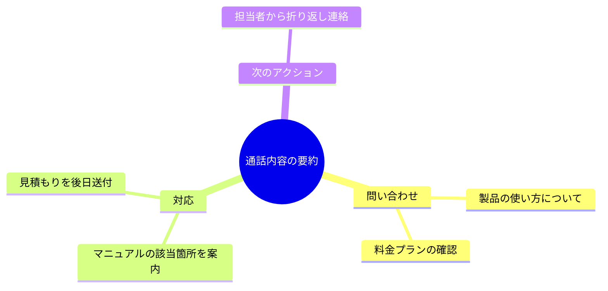
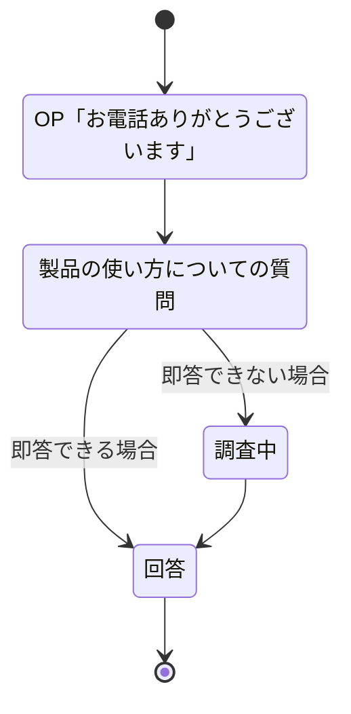
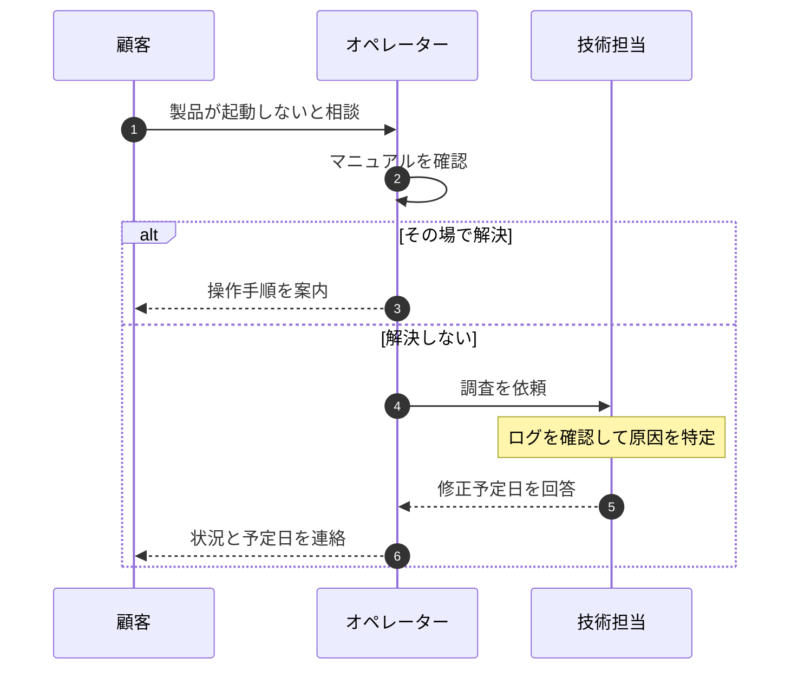
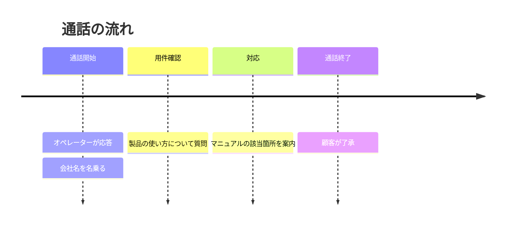
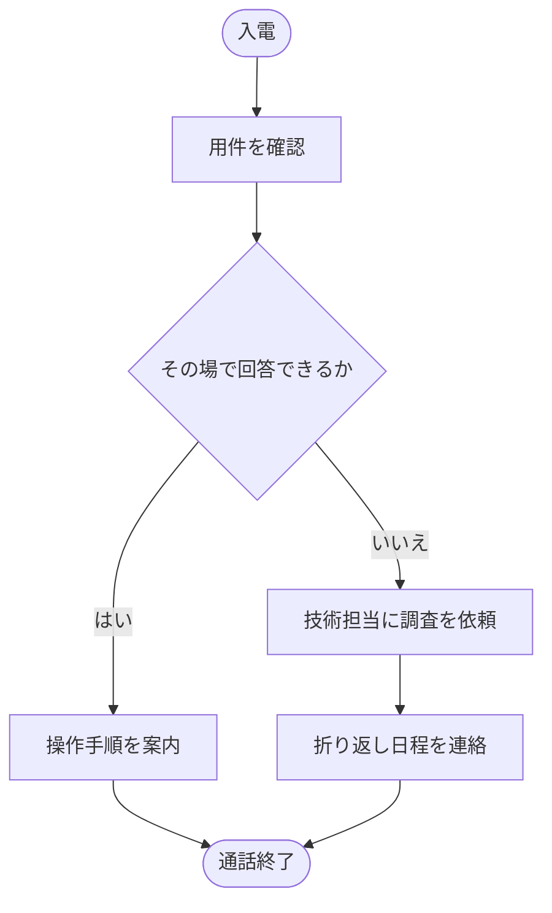

# 生成AI向け Mermaid 出力プロンプト（mmd2pdf 用）

通話内容などのテキストから Mermaid 記法を生成させるときに、そのまま貼って使えるプロンプトです。
以下のルールは mermaid 11.4.1 で実際に描画して検証しています。

---

## プロンプト本文（ここから下をコピーして使う）

あなたはテキストを図に変換する担当です。入力されたテキストの内容を、Mermaid 記法の図にしてください。

### 出力の形式

- 出力は ```mermaid で始まり ``` で終わるコードブロックだけにしてください。説明文や前置きは書かないでください。
- コードブロックの1行目は図の種類（`mindmap` / `stateDiagram-v2` / `sequenceDiagram` / `timeline` / `flowchart TD`）にしてください。
- 図は1つだけにしてください。複数必要な場合は、コードブロックを分けてください。
- インデントは半角スペースで揃えてください。タブは使わないでください。
- 1行に1つの要素だけを書いてください。

### 図の種類の選び方

| 入力の内容 | 使う図 |
|---|---|
| 話題や論点の整理、要約の全体像 | `mindmap` |
| 会話の状態や場面の移り変わり | `stateDiagram-v2` |
| 誰が誰に何を言ったかのやりとり | `sequenceDiagram` |
| 時間順の出来事の並び | `timeline` |
| 手順、条件分岐、業務の流れ | `flowchart TD` |

### すべての図に共通するルール

1. 日本語はそのまま使えます。かぎ括弧「」も使えます。
2. **半角の記号 `(` `)` `[` `]` `{` `}` `<` `>` `"` を文章中に使わないでください。** 括弧が必要なときは全角の（）を使ってください。
3. 発話を引用するときは「」で囲んでください。半角のダブルクォートは使わないでください。
4. 1つのラベルは20文字程度までにしてください。長くなる場合は `<br/>` で改行してください。
5. 個人名、電話番号、住所などの個人情報は、図に含めないでください（「顧客」「担当者」のように一般名詞にしてください）。
6. 要素の数は15個程度までにしてください。多い場合はまとめてください。
7. 自信がない書き方は使わず、下の例と同じ形だけを使ってください。

### 図の種類ごとのルール

**mindmap（マインドマップ）**

- 階層はインデントの深さだけで表します。記号は使いません。
- **ダブルクォートで囲まないでください。** 囲むと画面に `&quot;` と表示されます。
- **半角の丸括弧を使わないでください。** 文字が消えます。全角の（）を使ってください。
- 中心のノードだけ `root((テキスト))` の形で書きます。



**stateDiagram-v2（状態遷移図）**

- **1行に書けるコロンは1つだけです。** 説明文の中にコロンを入れないでください（必要なら全角の「：」にしてください）。
- 状態名に説明を付けるときは `状態名: 説明文` の形で、別の行に書きます。
- 開始と終了は `[*]` で表します。



**sequenceDiagram（シーケンス図）**

- 登場人物は `participant 短い英数字ID as 表示名` で先に定義します。
- メッセージは `送り手->>受け手: 内容` の形で書きます。返答は `-->>` を使います。
- 補足は `note over ID: 内容` で書けます。
- 条件分岐は `alt 条件` / `else 別の条件` / `end` で囲みます。



**timeline（タイムライン）**

- `期間 : 出来事 : 出来事` の形で、コロンが区切り記号になります。
- **出来事の文章の中にコロンを入れないでください。** 入れると項目が分かれてしまいます。
- 1行目に `title タイトル` を書きます。



**flowchart（フローチャート）**

- 1行目は `flowchart TD`（上から下）または `flowchart LR`（左から右）にします。
- ノードは `ID["テキスト"]` の形で、**テキストを必ずダブルクォートで囲んでください。** 囲めば、テキスト内の半角括弧やコロンも安全に使えます。
- 判断は `ID{"テキスト"}`、開始と終了は `ID(["テキスト"])` を使います。
- 矢印のラベルは `-->|ラベル|` の形で書きます。ラベルはダブルクォートで囲みません。
- まとまりを作るときは `subgraph 名前` と `end` で囲みます。



### 最後に確認すること

出力する前に、次を自分で確認してください。

- 半角の `(` `)` `[` `]` `{` `}` `"` が、ノードの形を表す記号以外の場所に残っていないか
- stateDiagram-v2 の各行に、コロンが2つ以上ないか
- timeline の出来事の文章に、コロンが入っていないか
- mindmap で、ダブルクォートや半角の丸括弧を使っていないか
- 図の1行目が、図の種類の宣言になっているか

---

## 補足

- mmd2pdf は ```mermaid ブロックを含む Markdown をそのまま渡せます。ブロックが複数あれば1図1ページになります。
- 記法に誤りがあっても処理は止まらず、エラー内容と入力を記したページが出力されます。エラーの内容をそのまま生成AIに渡して直させることもできます。
