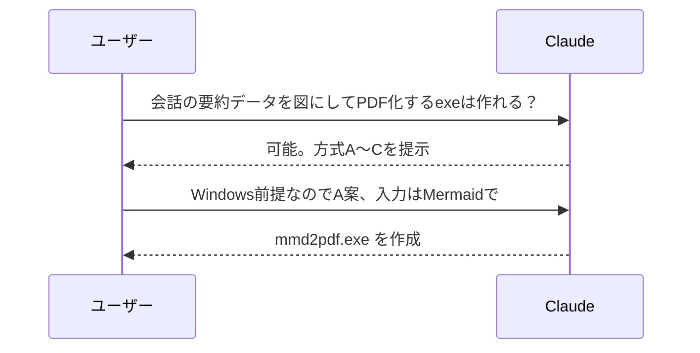
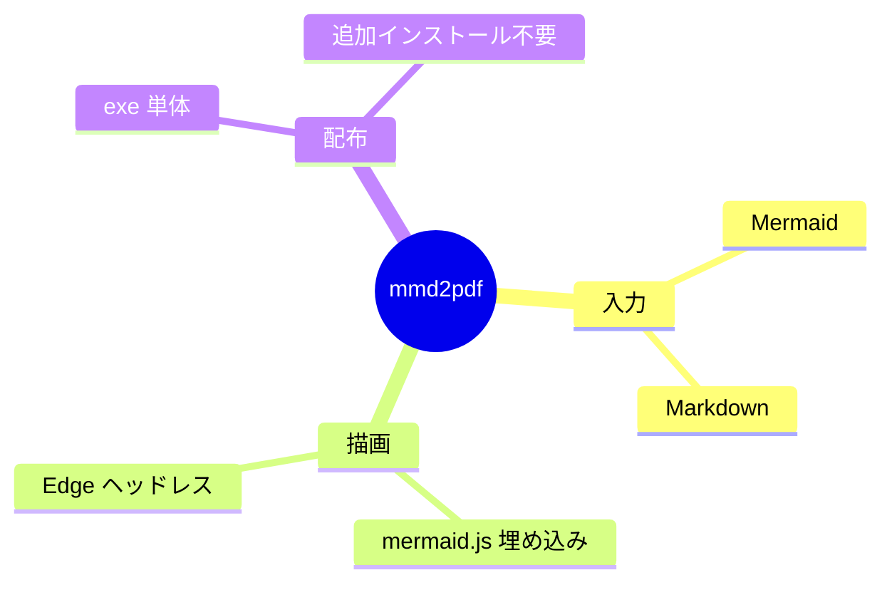

# 会話の要約

## やりとりの流れ

```mermaid
sequenceDiagram
    participant U as ユーザー
    participant C as Claude
    U->>C: 会話の要約データを図にしてPDF化するexeは作れる？
    C-->>U: 可能。方式A〜Cを提示
    U->>C: Windows前提なのでA案、入力はMermaidで
    C-->>U: mmd2pdf.exe を作成
```

## 論点の整理

```mermaid
mindmap
  root((mmd2pdf))
    入力
      Mermaid
      Markdown
    描画
      mermaid.js 埋め込み
      Edge ヘッドレス
    配布
      exe 単体
      追加インストール不要
```
